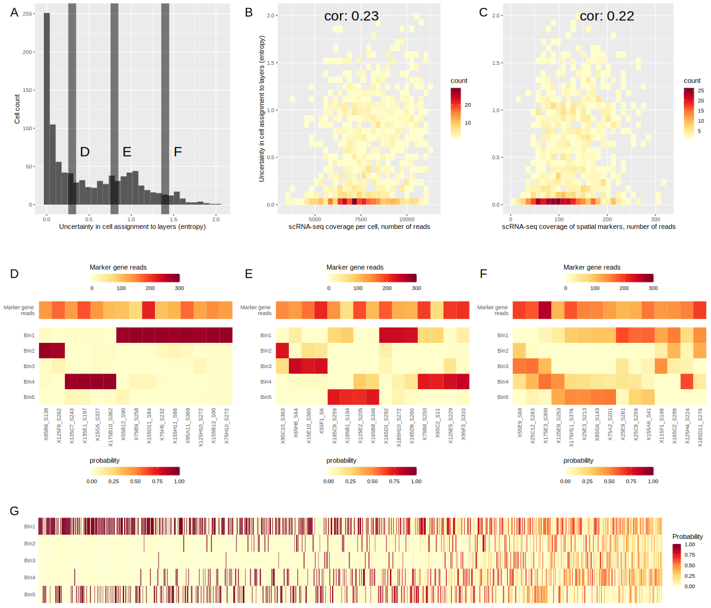

```{r setup, include=FALSE}
knitr::opts_chunk$set(echo = TRUE)

suppressPackageStartupMessages({
  library(ParetoTI)
  library(SingleCellExperiment)
  library(Seurat)
  library(data.table)
  library(ggplot2)
  library(cowplot)
  library(Matrix)
})
source("./helper_fun.R")
```

### 1. Validation of high-throughput FISH: Are the transcripts used for astrocyte heterogeneity classification expressed at the same (or similar) levels as those used to describe neurons in these validation experiments? If they are much lower what is the possibility that the described layers are artifacts? 

```{r fig.height=5, fig.width=10}
p56_cells = fread("./data/Omer_astrocytes/p56_mix.csv", stringsAsFactors = F)
cells = fread("./data/Omer_both_n_a/2019-04-12-AstroVsNeurons_P14cor.tsv",
                      stringsAsFactors = F)
negative = fread("./data/Omer_both_n_a/00_techreplicates_negs/omer_20180615_smFISHcontrols.tsv",
                      stringsAsFactors = F)
negative = negative[slide == "005X"]
# get all spot counts into one column

max_val = max(c(cells[cell.type == "neuro" |
                      (cell.type == "astro" &
                       genes %in% c("Chrdl1", "Eogt", "Id3", "Il33")), spotcounts],
                negative$Spotcounts_Rorb))

neg = ggplot(negative, aes(x = Spotcounts_Rorb)) +
  geom_histogram() + 
  facet_grid(ctxdepthInterval ~ genes) +
  theme_bw() +
  theme(panel.grid = element_blank()) +
  labs(x = "number of smFISH spots", title = "neurones") +
  expand_limits(x = max_val)

neu = ggplot(cells[cell.type == "neuro"], aes(x = spotcounts)) +
  geom_histogram() + 
  facet_grid(ctxdepthInterval ~ genes) +
  theme_bw() +
  theme(panel.grid = element_blank()) +
  labs(x = "number of smFISH spots", title = "neurones") +
  expand_limits(x = max_val)

ggplot(cells[cell.type == "astro"], aes(x = spotcounts)) +
  geom_histogram() + 
  facet_grid(ctxdepthInterval ~ genes) +
  theme_bw() +
  theme(panel.grid = element_blank()) +
  labs(x = "number of smFISH spots", title = "astrocytes") +
  expand_limits(x = max_val)

astro = ggplot(cells[cell.type == "astro" &
                       genes %in% c("Chrdl1", "Eogt", "Id3", "Il33")],
               aes(x = spotcounts)) +
  geom_histogram() + 
  facet_grid(ctxdepthInterval ~ genes) +
  theme_bw() +
  theme(panel.grid = element_blank()) +
  labs(x = "number of smFISH spots", title = "astrocytes") +
  expand_limits(x = max_val)
p = print(plot_grid(neu, astro, nrow = 1))
ggplot2::ggsave(p, width = 10, height = 5, units = "in",
                device = "svg", path = "./figures/paper/",
                filename = "FigSupp_neuron_vs_astro_marker_levels.svg")
```

## 2 How robust are low/mid/high RNA gene expression patterns?

```{r, fig.width=15, fig.height=15}
replicates_ast = fread("./data/Omer_both_n_a/01_2Xbioreps_50genes/20190425_P14sag_astrogenes_replicates.tsv",
                      stringsAsFactors = F)
replicates_neu = fread("./data/Omer_both_n_a/01_2Xbioreps_50genes/20190425_P14sag_neurongenes_replicates.tsv",
                      stringsAsFactors = F)

# Find medians
replicates_ast[, spotcounts_median := as.numeric(mean(spotcounts)), by = .(genes, replicate, ctxdepthInterval)]
replicates_neu[, spotcounts_median := as.numeric(mean(spotcounts)), by = .(genes, replicate, ctxdepthInterval)]
replicates_ast[, spotcounts_median_tot := as.numeric(max(spotcounts_median)), by = .(genes)]
replicates_neu[, spotcounts_median_tot := as.numeric(max(spotcounts_median)), by = .(genes)]

# Select medians
ra = unique(replicates_ast[, .(genes, replicate, ctxdepthInterval, spotcounts_median, spotcounts_median_tot)])
rn = unique(replicates_neu[, .(genes, replicate, ctxdepthInterval, spotcounts_median, spotcounts_median_tot)])

# transform data for plotting
ra = dcast.data.table(ra, genes + ctxdepthInterval + spotcounts_median_tot ~ replicate, value.var = "spotcounts_median")
ra = ra[complete.cases(ra)]

rn = dcast.data.table(rn, genes + ctxdepthInterval + spotcounts_median_tot ~ replicate, value.var = "spotcounts_median")
rn = rn[complete.cases(rn)]

# compute correlations between replicates across spatial bins for each gene
ra[, cor := cor(Brain1, Brain2), by = .(genes)]
rn[, cor := cor(Brain1, Brain2), by = .(genes)]

# add neuron vs astro label
ra[, cell_type := "astrocytes"]
rn[, cell_type := "neurones"]

ggplot(ra, aes(Brain1, Brain2, group = genes)) +
  geom_point() +
  facet_wrap( ~ paste0(genes, "\nCor = ", signif(cor, 2)), scales = "free") +
  labs(x = "Replicate 1", y = "Replicate 2")
```

```{r fig.height=3.5, fig.width=5}
r = rbind(ra, rn)

p = ggplot(unique(r[, .(genes, spotcounts_median_tot, cor, cell_type)]), 
           aes(spotcounts_median_tot, cor, color = cell_type)) +
  geom_point() + 
  ylim(-0.8, 1.3) +
  ggrepel::geom_text_repel(aes(label = ifelse(cor < 0.5 | cell_type == "neurones" |
                                                genes %in% c("Chrdl1", "Il33", "Id3"), genes, "")),
                           nudge_x = 5, nudge_y = 0.1) +
  labs(x = "Spotcounts in layer with max expression", y = "Correlation between replicates")
p
ggplot2::ggsave(p, width = 5, height = 3.5, units = "in",
                device = "svg", path = "./figures/paper/",
                filename = "FigSupp_replicate_correl_vs_mean_exprs.svg")
```

## 3  Major concern: - Do the authors should generate single cell RNA-seq using sorted Aldh1L1-GFP cortical cells and check if they can identify the same number of even more layer-specific clusters of astrocytes as they do with LaST.

```{r}
my_sce = readRDS("./data/Holt_astrocytes/sce_small_clust_removed.RDS")
my_sce_all = copy(my_sce)
sc3 = readRDS("./data/Holt_astrocytes/holt_astrocytes_sc3.rds")
sc3 = sc3[rowSums(assay(sc3, "counts") > 0) > 10,]

# compute GLMPCA
#source("../software/gmlpca/algs/glmpca.R")
#library(foreach)
#doParallel::registerDoParallel(3)
#nb_theta = foreach(g = seq_len(nrow(sc3)), .combine = c) %dopar% {
#  fit <- MASS::glm.nb(as.vector(counts(sc3[g,])) ~ 1)
#  fit$theta
#}

#glm_pcs = glmpca(Y = counts(sc3)[rowSums(assay(sc3, "counts") > 0) > 10,],
#                 L = 5, fam=c("poi","nb","mult","bern")[2], nb_theta = nb_theta)
#reducedDim(sc3, "NB-PCA") = glm_pcs$factors

my_sce = my_sce[, colnames(my_sce) %in% colnames(sc3)]
sc3_2 = sc3[, colnames(sc3) %in% colnames(my_sce)]
my_sce$sc3_6_clusters = sc3_2[, colnames(my_sce)]$sc3_6_clusters

# load Holt cluster annotations
data = read.table("./data/Holt_astrocytes/HOLTLAB_LnNormData_Cortex.tsv")
Type = data["Type",]
sc3$holt_clusters = t(Type)[,1][colnames(sc3)]

set.seed(1)
sc3 = scater::runPCA(sc3, 50, "irlba", ntop = 1000)# feature_set = rowData(sc3)$sc3_gene_filter)
print(scater::plotReducedDim(sc3, use_dimred = "PCA", ncomponents = 4, colour_by = "sc3_6_clusters"))

plot_arc(data = t(reducedDim(sc3, "PCA")), which_dimensions = 1:3,
         data_lab = as.character(sc3$sc3_6_clusters), colors = c("#1F77B4", "#D62728", 
        "#2CA02C", "#17BED0", "#006400", "#FF7E0F", "black"))

#plot_arc(data = t(reducedDim(sc3, "NB-PCA")), which_dimensions = 1:3,
#         data_lab = as.character(sc3$sc3_6_clusters), colors = c("#1F77B4", "#D62728", 
#        "#2CA02C", "#17BED0", "#006400", "#FF7E0F", "black"))
```

```{r fig.height=5, fig.width=13}
#library(propr)
#phi = propr(normcounts(sc3[rowData(sc3)$sc3_gene_filter,]) + 1, metric = "phi", symmetrize = TRUE)
#umaps = umap::umap(phi@matrix, n_neighbors = 5, metric = "precomputed", min_dist = 0.9,
#                                     method = c("umap-learn"))
#reducedDim(sc3, "UMAP") = umaps$layout

sc3 = scater::runUMAP(sc3, ntop = nrow(sc3), use_dimred = "PCA",
                      n_neighbors = 15, metric = "euclidean", min_dist = 0.1)
colnames(reducedDim(sc3, "UMAP")) = paste0("UMAP", 1:ncol(reducedDim(sc3, "UMAP")))

#sc3 = scater::runTSNE(sc3, perplexity = 1, use_dimred = "PCA")
#pcs = print(scater::plotReducedDim(sc3, use_dimred = "TSNE", ncomponents = 2, colour_by = "sc3_6_clusters"))

myPlotReducedDim = function(sce, use_dimred = "UMAP", ncomponents = 1:2, 
                            colour_by = "sc3_6_clusters", by_exprs_values = "logcounts",
                            point_size = 1, flip_order = FALSE, hue_begin = 1,
                            colorscale_direction = -1) {
  dimred = reducedDim(sce, use_dimred)[, ncomponents]
  col_names = paste0(use_dimred, ncomponents)
  colnames(dimred) = col_names
  dimred = as.data.table(dimred, keep.rownames = "cell_id")
  
  if(colour_by %in% rownames(sce)){
    dimred$colour_by = as.numeric(assay(sce[colour_by,], by_exprs_values))
  } else if(colour_by %in% colnames(colData(sce))) {
    dimred$colour_by = colData(sce)[, colour_by]
  }
  
  if(!flip_order) setorder(dimred, colour_by) else setorder(dimred, -colour_by)
  
  p = ggplot(dimred, aes(get(col_names[1]), get(col_names[2]),
                         color = colour_by, fill = colour_by)) +
    geom_point(size = point_size) +
    labs(color = colour_by, fill = colour_by, x = col_names[1], y = col_names[2])
  if(is.numeric(dimred$colour_by)) {
    col = colorRampPalette(RColorBrewer::brewer.pal(9, "YlOrRd"))(100)
    #p + scale_fill_gradientn(colours=col) +
    #  scale_color_gradientn(colours=col) 
    p + scale_color_viridis_c(direction = colorscale_direction, end = hue_begin) +
      scale_fill_viridis_c(direction = colorscale_direction, end = hue_begin)
  } else {
    # display.brewer.all(colorblindFriendly = TRUE)
    p + scale_colour_brewer(palette = "Dark2") + scale_fill_brewer(palette = "Dark2")  
  }
}

manual_colors = c(RColorBrewer::brewer.pal(3, "Dark2"), "grey80", "grey60", "grey40")
names(manual_colors) = c("1", "6", "2", "3", "4", "5")
pcs_0 = (myPlotReducedDim(sc3, use_dimred = "UMAP", ncomponents = 1:2,
                        colour_by = "sc3_6_clusters", flip_order = T)) +
  scale_color_manual(values = manual_colors)
pcs1 = (myPlotReducedDim(sc3, use_dimred = "UMAP", ncomponents = 1:2, colour_by = "Chrdl1"))
pcs2 = (myPlotReducedDim(sc3, use_dimred = "UMAP", ncomponents = 1:2, colour_by = "Id3"))
pcs3 = (myPlotReducedDim(sc3, use_dimred = "UMAP", ncomponents = 1:2, colour_by = "Il33"))
pcs4 = (myPlotReducedDim(sc3, use_dimred = "UMAP", ncomponents = 1:2, colour_by = "Gfap"))

pcs = print(plot_grid(pcs_0, pcs1, pcs2, pcs3, pcs4, nrow = 2, align = "hv"))
ggplot2::ggsave(pcs, width = 13, height = 5, units = "in",
               device = "svg", path = "./figures/paper/",
               filename = "Holt_UMAP_layer_markers.svg")

show_spatial_markers = function(n_clust = 6, filter = c(unique(cells$genes), unique(p56_cells$genes))) {
  inds.markers.pval <- which(sc3@rowRanges@elementMetadata@listData[[paste0("sc3_", n_clust,"_markers_padj")]]<1e-3)
  inds.markers.auroc <- which(sc3@rowRanges@elementMetadata@listData[[paste0("sc3_", n_clust,"_markers_auroc")]]>.5)
  inds.markers.both <- intersect(inds.markers.pval, inds.markers.auroc)
  clust_mark = data.table(gene = rownames(sc3)[inds.markers.both],
                          clust = sc3@rowRanges@elementMetadata@listData[[paste0("sc3_",n_clust,"_markers_clusts")]][inds.markers.both])
  if(!is.null(filter)) return(clust_mark[gene %in% filter]) else return(clust_mark)
}

# Show SC3 markers as spatial markers
show_spatial_markers(n_clust = 6)
show_spatial_markers(n_clust = 5)
show_spatial_markers(n_clust = 4)
show_spatial_markers(n_clust = 3)
show_spatial_markers(n_clust = 2)

show_spatial_markers(n_clust = 6, NULL)[clust %in% c(3,4,5)]

sc3_mark = data.table(markers_padj = sc3@rowRanges@elementMetadata@listData[[paste0("sc3_", 6,"_markers_padj")]],
                      markers_auroc = sc3@rowRanges@elementMetadata@listData[[paste0("sc3_", 6,"_markers_auroc")]],
                      clust = sc3@rowRanges@elementMetadata@listData[[paste0("sc3_", 6,"_markers_clusts")]],
                      genes = rownames(sc3))
sc3_mark[genes %in% c("Il33")]

wilcox.test(as.numeric(logcounts(sc3["Il33", sc3$sc3_6_clusters == 2])),
            as.numeric(logcounts(sc3["Il33", sc3$sc3_6_clusters == 6])),
            alternative = "greater")
wilcox.test(as.numeric(logcounts(sc3["Il33", sc3$sc3_6_clusters == 1])),
            as.numeric(logcounts(sc3["Il33", sc3$sc3_6_clusters == 6])),
            alternative = "greater")
median(as.numeric(logcounts(sc3["Il33", sc3$sc3_6_clusters == 1])))
median(as.numeric(logcounts(sc3["Il33", sc3$sc3_6_clusters == 2])))
median(as.numeric(logcounts(sc3["Il33", sc3$sc3_6_clusters == 6])))

wilcox.test(as.numeric(logcounts(sc3["Chrdl1", sc3$sc3_6_clusters == 2])),
            as.numeric(logcounts(sc3["Chrdl1", sc3$sc3_6_clusters == 1])),
            alternative = "greater")
mean(as.numeric(logcounts(sc3["Chrdl1", sc3$sc3_6_clusters == 1])))
mean(as.numeric(logcounts(sc3["Chrdl1", sc3$sc3_6_clusters == 2])))
mean(as.numeric(logcounts(sc3["Chrdl1", sc3$sc3_6_clusters == 6])))
```

### Show Holt paper markers and clusters

```{r Unc13c_Agt_Ogt, width = 13, height = 5}
UMI = T
N_markers = 16
layer_levels = paste0("Bin", 1:5)
analysis_name = "astro_16mark_UMI_Ntotal180000_1000k_out_norm"

# load probability of cell assignment to layers and compute entropy
# read in probability weight matrix
weight_mat = fread(paste0("./spatial_mapping_code/", analysis_name, "/prob_cell_assignment_cells_x_zones_plus1.csv"))
setnames(weight_mat, colnames(weight_mat), layer_levels)

pred_layer = apply(weight_mat, 1, which.max)
my_sce_all$pred_layer = colnames(weight_mat)[pred_layer]
# add pred_layer to sc3 object
sc3$pred_layer = colnames(weight_mat)[pred_layer[colnames(sc3)]]
# how many cells map to each layer? (hard assignment)
table(my_sce_all$pred_layer)

weight_mat = as.matrix(weight_mat)
rownames(weight_mat) = colnames(my_sce_all)

# compute posterior probability matrix making probabilities for each cell sum to 1
prob_mat = weight_mat / Matrix::rowSums(weight_mat)
# remove cells with 0 probabilities (this happens when the likelyhood to see expression profile of this cell given expression in each layer is numerically approaching 0)
prob_mat = prob_mat[rowSums(is.na(prob_mat)) < 1, ]

# calculate how spread out profiles are using entropy
entropy_new = -rowSums(prob_mat * log2(prob_mat), na.rm = T)
# load saved
entropy = readRDS(paste0("./spatial_mapping_code/", analysis_name, "/cell_assignment_entropy.RDS"))
# add entropy to sc3 object
sc3$spatial_bin_entropy = entropy[colnames(sc3)]

pcs2 = (myPlotReducedDim(sc3, use_dimred = "UMAP", ncomponents = 1:2, colour_by = "Unc13c"))
pcs3 = (myPlotReducedDim(sc3, use_dimred = "UMAP", ncomponents = 1:2, colour_by = "Agt"))
pcs4 = (myPlotReducedDim(sc3, use_dimred = "UMAP", ncomponents = 1:2, colour_by = "Ogt"))
pcs5 = (myPlotReducedDim(sc3, use_dimred = "UMAP", ncomponents = 1:2, colour_by = "spatial_bin_entropy"))
pcs6 = (myPlotReducedDim(sc3, use_dimred = "UMAP", ncomponents = 1:2, colour_by = "holt_clusters"))

pcs = print(plot_grid(pcs_0, pcs2, pcs3, pcs4, pcs5, pcs6, nrow = 2, ncol = 3, align = "hv"))
ggplot2::ggsave(pcs, width = 13, height = 5, units = "in",
               device = "svg", path = "./figures/paper/",
               filename = "Holt_UMAP_layer_markers_new_Unc13c_Agt_Ogt.svg")
```

### Show cortical layer probabilities for cells

```{r fig.height=10, fig.width=17}
# add bin assignment probabilities to sce
for (col in colnames(prob_mat)) {
  colData(sc3)[, paste0("Prob_", col)] = prob_mat[, col][colnames(sc3)]
}

manual_colors = c(RColorBrewer::brewer.pal(3, "Dark2")[1:2], "grey85", "grey70", "grey55")
names(manual_colors) = c("AST2", "AST3", "AST1", "AST5", "AST4")
pcs_pcs_0 = myPlotReducedDim(sc3, use_dimred = "PCA", ncomponents = c(1, 3),
                             colour_by = "holt_clusters", flip_order = T) +
  scale_color_manual(values = manual_colors)

manual_colors = c(RColorBrewer::brewer.pal(4, "Dark2"), "grey60", "grey80")
names(manual_colors) = c("1", "6", "2", "3", "4", "5")
pcs_pcs_1 = myPlotReducedDim(sc3, use_dimred = "PCA", ncomponents = c(1, 3),
                             colour_by = "sc3_6_clusters", flip_order = T) +
  scale_color_manual(values = manual_colors)

col_list = c(paste0("Prob_", colnames(prob_mat)),
             "Id3", "Chrdl1", "Il33", "Gfap", "Eogt", "Mfge8",
             "Unc13c", "Agt", "Ogt")
prob_plot_list = lapply(col_list, function(col) {
  myPlotReducedDim(sc3, use_dimred = "PCA", ncomponents =  c(1, 3), colour_by = col,
                   hue_begin = 0.75)
})

pcs = print(plot_grid(plotlist = c(list(pcs_pcs_0, pcs_pcs_1), prob_plot_list), nrow = 4, ncol = 4, align = "hv"))
ggplot2::ggsave(pcs, width = 17, height = 10, units = "in",
               device = "svg", path = "./figures/paper/",
               filename = "Holt_UMAP_layer_assignment_probabilities.svg")
```

## Neurotransmission genes

```{r}
neurotrans_list = c("Id3", "Chrdl1", "Il33", "Gfap",
             "Adra1a",
             "Adra1b",
             "Adra2a",
             "Gabbr1",
             "Grm3",
             "Grm5",
             "Drd1",
             "Drd2",
             "Slc6a1",
             "Slc6a11",
             "Slc1a3",
             "Slc1a2",
             "Slc6a3",
             "Slc6a2",
             "Hrh1",
             "Hrh2",
             "Hrh3",
             "Gria2", #
             "Grin2c",
             "Kcnn2",
             "Kcnn3",
             "Itpr2",
             "Slc7a11",
             "Chrna7",
             "Fabp7")
neurotrans_list = neurotrans_list[neurotrans_list %in% rownames(sc3)]
prob_plot_list = lapply(neurotrans_list, function(col) {
  myPlotReducedDim(sc3, use_dimred = "PCA", ncomponents =  c(1, 3), colour_by = col,
                   hue_begin = 0.75)
})

pcs = print(plot_grid(plotlist = c(list(pcs_pcs_0, pcs_pcs_1), prob_plot_list),
                      nrow = 5, ncol = 5, align = "hv"))
ggplot2::ggsave(pcs, width = 21.25, height = 12.5, units = "in",
               device = "svg", path = "./figures/",
               filename = "Holt_UMAP_neurotransmission_genes.svg")
```

## Figure 4 plots

### Fig4 A

```{r fig.height=4, fig.width=7.5}
pcs_pcs_0 = myPlotReducedDim(sc3[, !is.na(sc3$holt_clusters)], use_dimred = "PCA", ncomponents = c(1, 3),
                             colour_by = "holt_clusters", point_size = 2) +
    scale_x_continuous(breaks = c(-10, 0, 10))
col_list = c("Unc13c", "Agt")
prob_plot_list = lapply(col_list, function(col) {
  myPlotReducedDim(sc3, use_dimred = "PCA", ncomponents =  c(1, 3), colour_by = col,
                   hue_begin = 0.75, point_size = 0.5) +
    scale_x_continuous(breaks = c(-10, 0, 10))
})
prob_plot_list = plot_grid(plotlist = prob_plot_list,
                      nrow = 2, ncol = 1, align = "hv")

pcs = print(plot_grid(plotlist = c(list(pcs_pcs_0), list(prob_plot_list)),
                      nrow = 1, ncol = 2, align = "hv", rel_widths = c(2,1.1)))
ggplot2::ggsave(pcs, width = 7.5, height = 4, units = "in",
               device = "svg", path = "./figures/paper/",
               filename = "Fig4_A_Holt_clusters_UMAP.svg")
```

### Fig4B

```{r fig.height=10, fig.width=18}
col_list = c(paste0("Prob_", colnames(prob_mat)),
             "Mfge8", "Chrdl1", "Eogt", "Il33", "Id3") # "Unc13c", "Agt", "Ogt" "Gfap"
prob_plot_list = lapply(col_list, function(col) {
  myPlotReducedDim(sc3, use_dimred = "PCA", ncomponents =  c(1, 3), colour_by = col,
                   hue_begin = 0.75)
})

pcs = print(plot_grid(plotlist = prob_plot_list, nrow = 4, ncol = 5, align = "hv"))
ggplot2::ggsave(pcs, width = 21.25, height = 10, units = "in",
               device = "svg", path = "./figures/paper/",
               filename = "Fig4B_Holt_UMAP_layer_assignment_prob_and_markers.svg")
```

### Holt cluster assignment probabilities to layers

```{r, fig.height=2.7, fig.width=8}
# calculate average probabilities for a heatmap
library(foreach)
sc3_noNA = sc3[, !is.na(sc3$holt_clusters) & !is.na(sc3$spatial_bin_entropy)]
compute_clust_location = function(clust_col = "holt_clusters", sc = sc3_noNA) {
  clust_data = colData(sc)[,clust_col]
  means = foreach(clust = rep(unique(clust_data), ncol(prob_mat)), 
                  layers = rep(paste0("Prob_", colnames(prob_mat)), 
                               each = uniqueN(clust_data)),
                  .combine = rbind) %do% {
                    x = mean(colData(sc)[clust_data %in% clust, layers])
                    data.table(means = x, 
                               cluster = clust, cluster_name = clust_col,
                               bin = layers,
                               clust_cell_count = sum(clust_data %in% clust))
                  }
  setorder(means, -bin, cluster)
  means[, bin := factor(bin, levels = unique(bin))]
  means[, cluster := factor(cluster, levels = unique(cluster))]
  means
}

loc = compute_clust_location(clust_col = "holt_clusters")
loc[cluster %in% c("AST2", "AST3"), cluster := paste0("*", cluster, "*")]
holt_plot = ggplot(loc,
              aes(x = cluster, y = bin, color = means, fill = means)) +
  geom_tile() +
  facet_wrap(~ cluster_name) + 
  ob5_theme_change +
  scale_fill_gradientn(colours=ob5_col) +
  scale_color_gradientn(colours=ob5_col) +
  ggtitle("Louvain clustering (Holt et al paper)")

loc = compute_clust_location(clust_col = "sc3_6_clusters")
loc[cluster %in% c(1,2,3,6), cluster := paste0("*", cluster, "*")]
sc3_plot = ggplot(loc,
             aes(x = cluster, y = bin, color = means, fill = means)) +
  geom_tile() +
  facet_wrap(~ cluster_name) + 
  ob5_theme_change +
  scale_fill_gradientn(colours=ob5_col) +
  scale_color_gradientn(colours=ob5_col) +
  ggtitle("SC3 clustering")

p = cowplot::plot_grid(holt_plot, sc3_plot, align = "hv")
p
ggplot2::ggsave(p, width = 8, height = 2.7, units = "in",
               device = "svg", path = "./figures/paper/",
               filename = "FigSupp_cluster_location_SC3_Louvain.svg")
```

### Show different numbers of SC3 clusters

```{r fig.height=5, fig.width=13}
pcs = (myPlotReducedDim(sc3, use_dimred = "UMAP", ncomponents = 1:2, colour_by = "sc3_2_clusters"))
pcs1 = (myPlotReducedDim(sc3, use_dimred = "UMAP", ncomponents = 1:2, colour_by = "sc3_3_clusters"))
pcs2 = (myPlotReducedDim(sc3, use_dimred = "UMAP", ncomponents = 1:2, colour_by = "sc3_4_clusters"))
pcs3 = (myPlotReducedDim(sc3, use_dimred = "UMAP", ncomponents = 1:2, colour_by = "sc3_5_clusters"))
pcs4 = (myPlotReducedDim(sc3, use_dimred = "UMAP", ncomponents = 1:2, colour_by = "sc3_6_clusters"))

pcs = print(plot_grid(pcs, pcs1, pcs2, pcs3, pcs4, nrow = 2, align = "hv"))

grey_clusters = function(sce, colour_by = "sc3_6_clusters"){
   
  plot_list = lapply(sort(unique(colData(sce)[, colour_by])), function(clust_id){
    
    sce_copy = copy(sce)
    
    colData(sce_copy)[, colour_by] = as.character(colData(sce_copy)[, colour_by])
    colData(sce_copy)[colData(sce_copy)[, colour_by] != clust_id, colour_by] = "other"
    colData(sce_copy)[, colour_by] = factor(colData(sce_copy)[, colour_by], 
                                            levels = c(clust_id, "other"))
    
    col =  c("grey10", "grey90")
    
    myPlotReducedDim(sce_copy, use_dimred = "PCA", ncomponents = c(1,3),
                     colour_by = colour_by, flip_order = T) +
      scale_color_manual(values = col)
  })
  plot_grid(plotlist = plot_list, nrow = 2, align = "hv")
}

grey_umap = grey_clusters(sc3, colour_by = "sc3_6_clusters")
grey_umap
ggplot2::ggsave(grey_umap, width = 13, height = 5, units = "in",
               device = "svg", path = "./figures/paper/",
               filename = "Holt_UMAP_grey_sc3_clusters.svg")

grey_umap = grey_clusters(sc3[, !is.na(sc3$holt_clusters)], colour_by = "holt_clusters")
grey_umap
ggplot2::ggsave(grey_umap, width = 13, height = 5, units = "in",
               device = "svg", path = "./figures/paper/",
               filename = "Holt_UMAP_grey_holt_clusters.svg")
```

## Convert to Seurat, do louvain clustering 

```{r seu_louv, fig.height=5, fig.width=8, eval=FALSE}
# convert to seurat
sc3_seu = as.Seurat(sc3)

# find variable genes using seurat
#sc3_seu = FindVariableGenes(object = sc3_seu, mean.function = ExpMean,
#                               dispersion.function = LogVMR, x.low.cutoff = 0.0125,
#                               x.high.cutoff = 3, y.cutoff = 0.5)
#sc3_seu@scale.data = sc3_seu@data

# find PCs
#sc3_seu = RunPCA(object = sc3_seu, pc.genes = sc3_seu@var.genes,
#                    pcs.compute = 50, pcs.print = 0)

#sc3_seu@dr$PCA
# generate SNN graph and use Louvain clustering to find clusters
#sc3_seu = FindClusters(object = sc3_seu, reduction.type = "PCA", dims.use = 1:50, 
#    resolution = 1.4, print.output = 0, save.SNN = FALSE, algorithm = 2)
Idents(sc3_seu) = sc3_seu$holt_clusters
sc3_seu = Seurat::FindMarkers(sc3_seu, ident.1 = "AST2", ident.2 = "AST3")
sc3_seu = sc3_seu[sc3_seu$p_val_adj < 0.05,]
dim(sc3_seu)

# convert back to sce
sc3_sce = as.SingleCellExperiment(sc3_seu)
saveRDS(sc3_sce, "./data/Holt_astrocytes/SC3_and_seurat.RDS")

clust_lab = grep("res", colnames(colData(sc3_sce)), value = T)
pcs = (myPlotReducedDim(sc3_sce, use_dimred = "UMAP", ncomponents = 1:2,
                                   colour_by = clust_lab))
pcs1 = (myPlotReducedDim(sc3_sce, use_dimred = "UMAP", ncomponents = 1:2, colour_by = "Chrdl1"))
pcs2 = (myPlotReducedDim(sc3_sce, use_dimred = "UMAP", ncomponents = 1:2, colour_by = "Id3"))
pcs3 = (myPlotReducedDim(sc3_sce, use_dimred = "UMAP", ncomponents = 1:2, colour_by = "Il33"))

pcs = print(plot_grid(pcs, pcs1, pcs2, pcs3, nrow = 2))

table(SC3 = sc3$sc3_6_clusters, Seurat = sc3_sce$res.1.4)
```

## Comparing SC3, Seurat clustering and Holt annotations

```{r}
# compare to Holt clusters
table(SC3 = sc3$sc3_6_clusters, Holt = sc3$holt_clusters)
```

```{r, eval=FALSE}
sc3$holt_clusters = t(Type)[,1][colnames(sc3)]
table(Seurat = sc3_sce$res.1.4, Holt = sc3$holt_clusters)
```

```{r}
# compare Holt clusters to layer assignment
table(pred_layer = sc3$pred_layer, Holt = sc3$holt_clusters)
table(pred_layer = sc3$pred_layer, SC3 = sc3$sc3_6_clusters)
```

## Plot marker distributions across clusters

```{r fig.height=5, fig.width=15}
library(ggridges)

plot_genes_ridges = function(sce, genes = c("Chrdl1", "Il33", "Id3"), assay = "logcounts",
                             clust_col = "sc3_6_clusters", violin = F) {
  dt = lapply(genes, function(gene) {
    data.table(expression = as.numeric(assay(sce[gene, ], assay)),
               clust = colData(sce)[, clust_col],
               gene = gene)
  })
  dt = rbindlist(dt)
  
  if(!violin) {
    
    ggplot(dt, aes(x = expression, y = clust, group = clust,
                 color = clust, fill = clust)) +
    ggridges::geom_density_ridges(alpha = 0.5, rel_min_height = 0.005) +
    facet_grid(. ~ gene) + 
    scale_x_continuous(limits = c(0, max(dt$expression))) +
    ggridges::theme_ridges() +
      scale_fill_brewer(palette = "Dark2") +
      scale_color_brewer(palette = "Dark2")
    
  } else {
    
    ggplot(dt, aes(y = expression, x = clust, group = clust,
                   color = clust, fill = clust)) +
      geom_violin() +
      facet_grid(~ gene ~ .) + 
      scale_y_continuous(limits = c(0, max(dt$expression))) +
      theme(strip.text.y = element_text(angle = 0)) +
      scale_fill_brewer(palette = "Dark2") +
      scale_color_brewer(palette = "Dark2")
    
    
  }
}

plot_genes_average = function(sce, genes = c("Chrdl1", "Il33", "Id3"), assay = "logcounts",
                              clust_col = "sc3_6_clusters", average = mean) {
  dt = lapply(genes, function(gene) {
    data.table(expression = as.numeric(assay(sce[gene, ], assay)),
               clust = colData(sce)[, clust_col],
               gene = gene)
  })
  dt = rbindlist(dt)
  dt[, average_expression := average(expression), by = .(gene, clust)]
  
  ggplot(dt, aes(y = gene, x = clust,
                   color = average_expression, fill = average_expression)) +
      geom_raster() +
      scale_fill_viridis_c(limits = c(0, max(dt$average_expression))) +
    scale_color_viridis_c(limits = c(0, max(dt$average_expression)))
}

#plot_genes_ridges(sc3_sce, genes = unique(p56_cells$genes), assay = "logcounts",
#                             clust_col = "sc3_6_clusters")
plot_genes_ridges(my_sce, genes = unique(p56_cells$genes), assay = "logcounts",
                             clust_col = "sc3_6_clusters")
```

```{r fig.height=15, fig.width=5}
#plot_genes_ridges(sc3_sce, genes = unique(p56_cells$genes), assay = "logcounts",
#                             clust_col = "sc3_6_clusters", violin = T)
plot_genes_ridges(my_sce, genes = unique(p56_cells$genes), assay = "logcounts",
                             clust_col = "sc3_6_clusters", violin = T)
```

```{r}
#plot_genes_average(my_sce, genes = unique(p56_cells$genes), assay = "logcounts",
#                             clust_col = "sc3_6_clusters", average = mean)
plot_genes_average(sc3, genes = unique(p56_cells$genes), assay = "logcounts",
                             clust_col = "sc3_6_clusters", average = mean)

#plot_genes_average(my_sce, genes = unique(p56_cells$genes), assay = "logcounts",
#                             clust_col = "sc3_6_clusters", average = median)
plot_genes_average(sc3, genes = unique(p56_cells$genes), assay = "logcounts",
                             clust_col = "sc3_6_clusters", average = median) +
  labs(color = "median expression", fill = "median expression")
```

## Compare entropy of spatial mapping to QC metrics



## Save SC3 SCE with probabilities

```{r}
saveRDS(sc3, "./processed_data/sc3_with_layer_prob.RDS")
```
